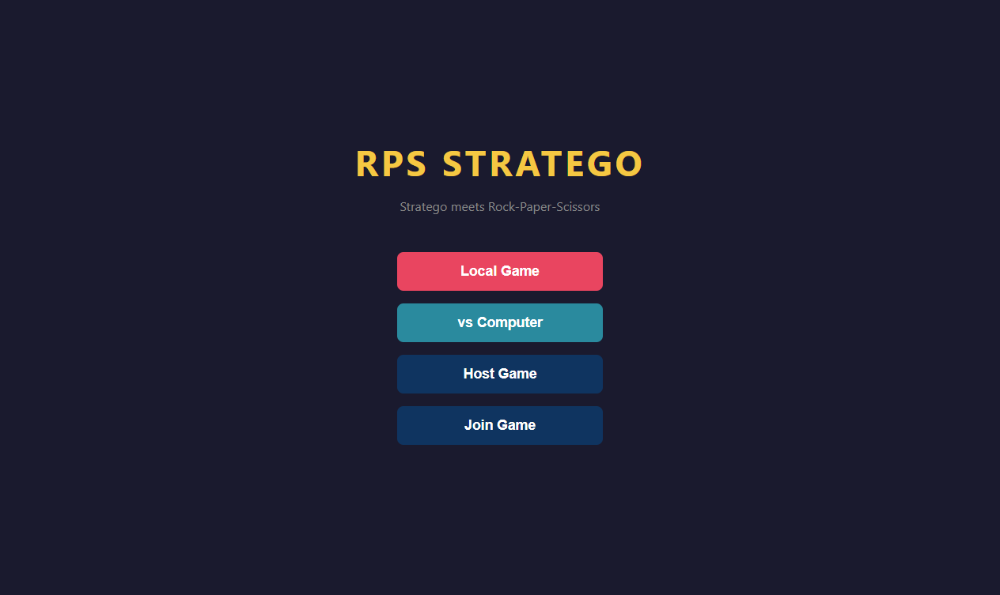
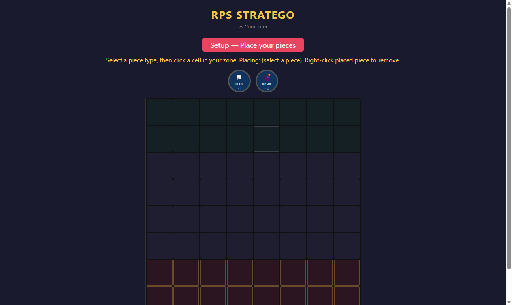
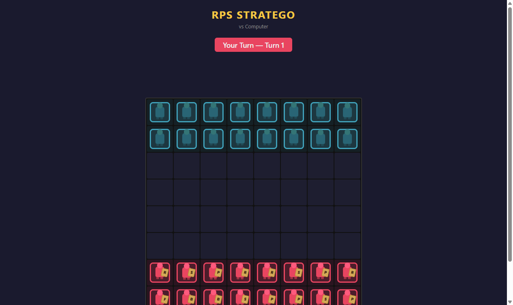
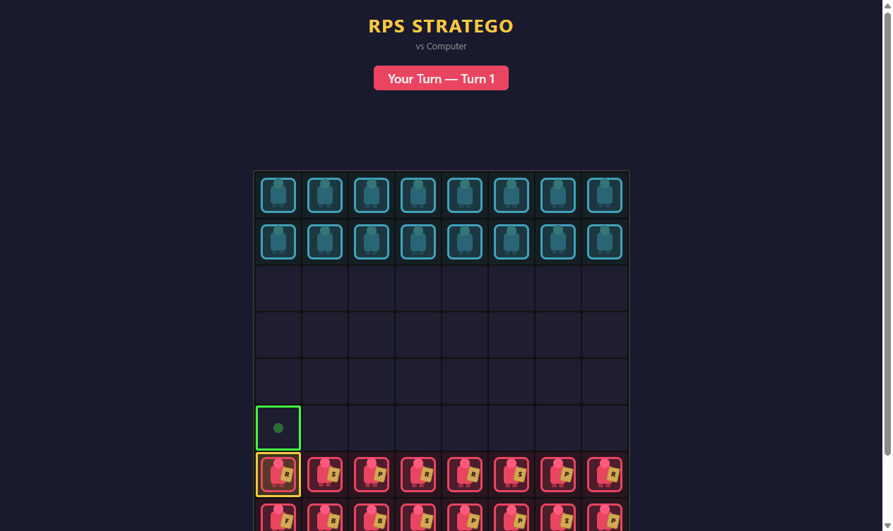
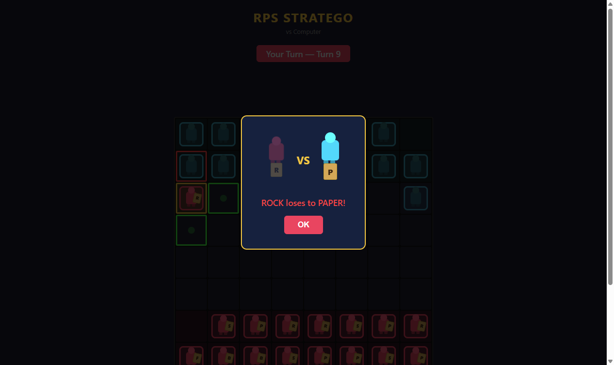

# RPS Stratego

A strategy board game that combines **Stratego** (hidden information, tactical deployment) with **Rock-Paper-Scissors** combat mechanics. Built with Flask and vanilla JavaScript.



## How It Works

Each player deploys **Rock**, **Paper**, **Scissors**, **Flag**, and **Bomb** pieces on their side of the board. Opponent pieces are hidden until combat. Pieces move one cell orthogonally, and when two pieces collide, RPS rules decide the winner:

- Rock beats Scissors
- Scissors beats Paper
- Paper beats Rock
- Capturing the opponent's **Flag** wins the game
- **Bombs** destroy any attacker (both pieces are removed)

## Game Modes

- **Local Game** — Two players on one device, taking turns
- **vs Computer** — Play against a heuristic AI or a neural network AI
- **Online** — Host or join a game with a 6-character room code

## Screenshots

### Setup Phase
Place your Flag and Bombs strategically, then the remaining pieces are auto-filled.



### Gameplay
Your pieces (red) show their type; opponent pieces (cyan) stay hidden until revealed through combat.



### Piece Selection
Click a piece to see valid moves (green) and attack targets (red).



### Combat
When pieces collide, an animated combat overlay reveals both types and shows the result.



## Getting Started

### Prerequisites

- Python 3.10+
- pip

### Installation

```bash
pip install -r requirements.txt
```

### Running

```bash
python app.py
```

Then open [http://localhost:5000](http://localhost:5000) in your browser.

### Running with Neural Network AI

To play against the trained neural network instead of the heuristic AI, append `?ai=nn` to the computer game URL. Train your own model with:

```bash
python train.py
```

## Tech Stack

- **Backend:** Flask
- **Frontend:** HTML5, CSS3, vanilla JavaScript
- **AI:** Heuristic priority-based engine + PyTorch neural network (self-play reinforcement learning)
- **Testing:** Pytest + Selenium (E2E)
